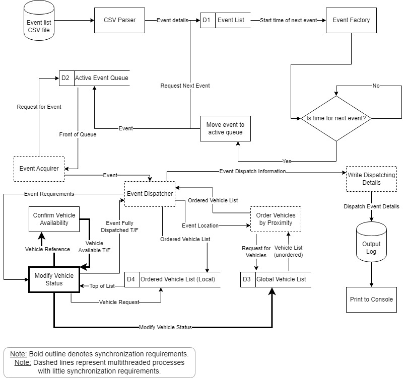

# Software Design Document

## Introduction
This document serves to outline the software design for a fire dispatching and scheduling program. The program will replicate a district's fire dispatching system by taking as input events requiring emergency assistance, determining the resources available to respond and assigning the resources accordingly. The purpose of this program is to demonstrate the capability of lock-free programming and the program will therefore be built in a multithreaded manner using lock-free synchronization techniques.

## Problem Definition
The dispatching of emergency services is a scheduling problem faced by local districts nearly everywhere in the world. Typically, especially in smaller districts the events are infrequent enough that this problem can be handled manually, but in larger areas with more complex emergency infrastructure, automated dispatching can be invaluable. While this program is focused on fire dispatching, the system is easily transportable to police or Emergency Medical Service (EMS) dispatching.

The primary difference between this problem and a typical scheduling problem is the fact that the events to whom emergency resources are being scheduled are not identical. Of course different fires take different amount of times to properly contain, but there also exists different varieties of emergency fire vehicles with different capabilities and each situation has different vehicle and crew requirements. Since fire stations are located in different locations around the district, the dispatching of crew to each situation must take into account the requirements of the situation, the proximity of vehicles to the situation, and the statuses of the vehicles, as they may be responding to other incidents or undergoing maintenance. 

For more information, see the [Literature Review](../../Course_Evaluation/Literature_Survey/EMcNamara_LiteratureSurvey.pdf) for more information on the benefits and comprimises of lock-free programming.

## Program Architecture
The program will be developed in C++ using abstract and non-abstract classes. There will not exist a central scheduling entity but rather each event will be handled individually and will be dispatched resources based on the availability of resources in the shared data structure. For the purposes of this project, there will exist two varieties of fire emergency vehicles, `FireLadder` and `FireEngine`. In real-world fire dispatching, there exist several other types of fire trucks, but to represent the fact that real-world emergency situations each have different requirements without over-complicating the development only two types of fire trucks are to be considered.

The below diagram demonstrates the classes and the inheritance that exists between them:

### `Event` Class
The `Event` class represents an event to which one or more vehicles must respond. The abstract `Event` class will be extended by the `CriticalSituation` and `Maintenance` classes. The `CriticalSituation` class will be an event to which crews must be dispatched as soon as possible. The `Maintenance` class will be an event to which an individual vehicle must be dispatched, but is not necessarily so time-sensitive and could be delayed until after a `CriticalSituation` is handled. 

### `Vehicle` Class
The `Vehicle` class represents an entity that carries crew members and equipment from a fire station to a critical event and upon whom maintenance is regularly performed. The abstract `Vehicle` class will be extended by the `FireEngine` and `FireLadder` classes. These non-abstract classes will retain all the attributes of the abstract class but will carry different equipment and will thus be fit for different critical situations as needed.

### `FireStation` Class
The `FireStation` class represents a physical entity in which vehicles are stored. This will be the location in which vehicles are located when they are not responding to a call or undergoing maintenance. Each station will be assigned vehicles and crew members, which may change throughout the duration of the simulation as the dispatch system feels is required.

### `Location` Class
The `Location` class is a simple data structure containing the two-dimensional coordinates representing the location on the grid of a particular resource or event. This two-dimensional representation is meant to be similar to latitude and longitude. Travel time from one location to another will use the distance as the crow flies rather than a more realistic travel time via the available roads. In this program a unit of distance will always take the same amount of time to travel regardless of the vehicle travelling and where in the grid the travel is occurring.

The region attribute is used to more accurately simulate a district's dispatching as a critical situation should ideally be dealt with by crews in the same region and only if no available crews exist will other regions be considered. Regions will represent an area of the map grid and will not necessarily be uniform in size.

### Shared Data Structures
As new events arrive, they will be assigned to a new thread whose goal it is to have the appropriate resources dispatched as required. Therefore, each vehicle and each fire station will be a member of the greater shared data structure in the system. To dispatch resources to an event, whether that be a `CriticalSituation` or `Maintenance`, will require knowing the current location of each vehicle, its current status (i.e. whether it is responding to another incident, available and ready to respond, or out of service), and the number of crew members on board the vehicle. Since each thread attempting to schedule an event is fighting for the same shared resources, there must exist a method of synchronization to ensure no race conditions or potential deadlocks can occur.

## Data Flow Diagram
With shared data divided among several classes, properly defined data flow is important to ensure synchronization and to guarantee program logic is not affected. The below data flow diagram defines how data will be passed between processes to dispatch vehicles to an event. The bolded process is the one in which synchronization is required, while the others allow for some benign (not affecting program logic) race conditions.

## Synchronization Difficulties
While synchronizing multithreaded programs is always a challenge, doing so in a lock-free manner will be particularly challenging due to the size of shared data elements. Lock-free techniques, such as `CAS`, are very effective for data elements that can be stored in a single word in memory but become more difficult to implement when the shared data structure grows. The synchronization of this program's threads may require the use of a double-word `CAS` function, an instruction not available on all machines, and/or `linked_load` and `store_conditional` instructions. Despite the challenges, it should still be possible to construct an algorithm without the use of locks.

## Program Verification
While writing a multithreaded program is relatively simple, writing a correct multithreaded program is much more difficult. To test whether the program developed is correct, there are two aspects which need to be considered: correctness and performance. The program must run properly and correctly to be considered successful as invalid logic or improper execution ordering can result in a program that does not meet the outlined requirements. Additionally, the purpose of developing a multithreaded program is to improve the program's performance compared to the single-threaded alternative. 

### Evaluation Framework - Correctness
Lorem ipsum

### Evaluation Framework - Performance
Lorem ipsum

## Final Considerations
Lorem ipsum